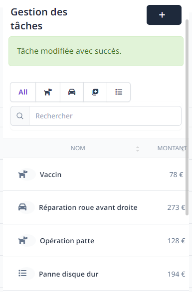
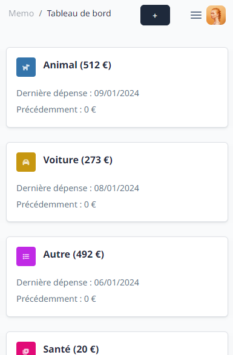

# MEMO

## About This project

PHP Tasks reminders (PWA).
- You can add/remove tasks for some domains (car, health, child, animal.) to avoid
to forgot them. 
- You can add attachments (for premium members only).
- You can share expenses between family members / friends.
- You can follow expenses by category year after year.
- You can set reminders to receive notifications on the relevant date
For this feature, you need to set Pusher.com > Beam API KEY in your .env.

Démo: https://memo.gameandme.fr/

## Installation
- git clone git@github.com:ynizon/memo.git
- cd memo
- composer install
- mv .env.example .env
- php artisan key:generate
- (if you need reminders, go to Pusher.com then set your Beam API KEY in your .env)

If you want admin@admin.com / admin user, use
- php artisan migrate --seed

If you don't want
- php artisan migrate

## Theme
Creative TIM
https://corporate-ui-dashboard-laravel.creative-tim.com/laravel-examples/users-management

## License

The Laravel framework is open-sourced software licensed under the [MIT license](https://opensource.org/licenses/MIT).

## Screenshots

